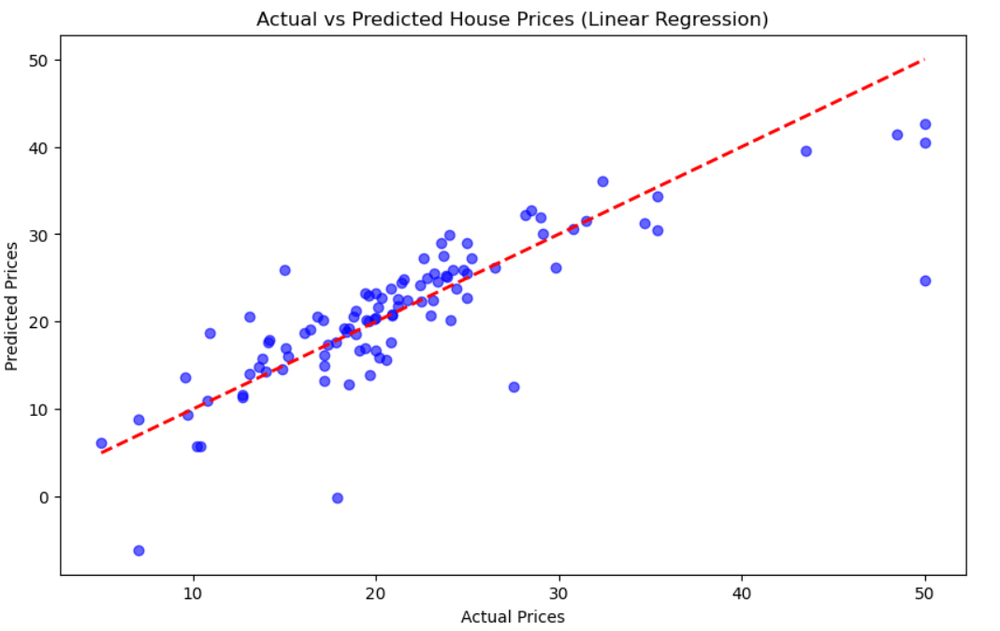

# 🐣 Level 1: Beginner - House Price Prediction

## 📄 Project Description
In this level, I focused on the fundamentals of Machine Learning pipelines. The main objective was to work with the **House Prediction Dataset** to clean the data and build a predictive model using **Linear Regression**.

---

## 📂 Directory Structure
This folder contains two main tasks:

1. **Task 1: Data Preprocessing** 🧹
   - Focuses on preparing the raw data for analysis.
   - Handling missing values and scaling features.
   
2. **Task 2: Linear Regression Model** 📈
   - Focuses on training a model to predict house prices.
   - Evaluating model performance using statistical metrics.

---

## 🛠️ Tasks Breakdown

### 🔹 Task 1: Data Preprocessing
Located in: `Task_1_Preprocessing/`

**Key Steps:**
- **Data Loading:** Loaded the CSV data with whitespace delimiters.
- **Cleaning:** Used `SimpleImputer` to handle missing values by replacing them with the mean.
- **Splitting:** Divided data into **80% Training** and **20% Testing** sets.
- **Scaling:** Applied `StandardScaler` to normalize feature values (Z-score normalization).

### 🔹 Task 2: Linear Regression
Located in: `Task_2_Linear_Regression/`

**Key Steps:**
- **Model Training:** Implemented `LinearRegression` from Scikit-Learn.
- **Evaluation:** Calculated **MSE** (Mean Squared Error) and **R2 Score**.
- **Visualization:** Plotted the Regression Line against actual data points.

**🚀 Model Performance:**
| Metric | Score |
| :--- | :--- |
| **Accuracy (R2)** | 63% |
| **MSE** | 27.41 |

---

## 📊 Visual Results
Here is the comparison between Actual Prices vs. Predicted Prices:

*(Note: The black dashed line represents the ideal prediction, while red dots are the actual test values)*

---

## 💻 How to Run
1. Navigate to the specific task folder.
2. Open the `.ipynb` file using Jupyter Notebook or Google Colab.
3. Ensure `house Prediction Data Set.csv` is in the same directory.
4. Run all cells to see the output.
